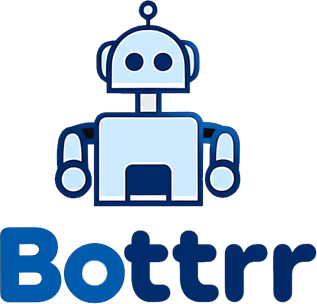

# Bottrr - Autobrr Discord Bot

A comprehensive Discord bot for managing Autobrr through Discord slash commands. This bot provides an intuitive interface to monitor downloads, manage filters, view system status, and handle administrative tasks directly from Discord.

## Features

- **System Monitoring**: Real-time status monitoring and system health checks
- **Filter Management**: View and manage Autobrr filters
- **Release Control**: Monitor, approve, and reject releases
- **Log Access**: View system logs directly in Discord
- **Settings Management**: Access and view Autobrr configuration
- **Role-based Permissions**: Secure access control with configurable roles
- **Comprehensive Error Handling**: Robust error handling and user feedback
- **Detailed Logging**: File-based logging with configurable levels

## Commands

| Command | Description | Required Permission |
|---------|-------------|-------------------|
| `/status` | Show Autobrr system status | Use Application Commands |
| `/filters` | Display all configured filters | Use Application Commands |
| `/filter <id>` | Show specific filter details | Use Application Commands |
| `/releases [limit]` | Show recent releases | Use Application Commands |
| `/approve <id>` | Approve a pending release | Manage Messages |
| `/reject <id>` | Reject a pending release | Manage Messages |
| `/logs [limit]` | Display recent system logs | Use Application Commands |
| `/settings` | View Autobrr settings | Administrator |

## Prerequisites

- Node.js 16.9.0 or higher
- A Discord Bot Token
- Access to an Autobrr instance
- Autobrr API key or username/password

## Installation

1. **Clone the repository**
   ```bash
   git clone https://github.com/yourusername/autobrr-discord-bot.git
   cd autobrr-discord-bot
   ```

2. **Install dependencies**
   ```bash
   npm install
   ```

3. **Configure environment variables**
   ```bash
   cp .env.example .env
   ```
   
   Edit the `.env` file with your configuration:
   ```env
   DISCORD_TOKEN=your_discord_bot_token_here
   DISCORD_CLIENT_ID=your_discord_application_id_here
   AUTOBRR_BASE_URL=http://localhost:7474
   AUTOBRR_API_KEY=your_autobrr_api_key_here
   ALLOWED_ROLES=admin,moderator,autobrr-admin
   ```

4. **Start the bot**
   ```bash
   npm start
   ```

   For development:
   ```bash
   npm run dev
   ```

## Discord Bot Setup

### Step 1: Create a Discord Application

1. Go to the [Discord Developer Portal](https://discord.com/developers/applications)
2. Click "New Application" and give it a name
3. Go to the "Bot" section and click "Add Bot"
4. Copy the bot token and add it to your `.env` file as `DISCORD_TOKEN`
5. Copy the Application ID from the "General Information" section and add it as `DISCORD_CLIENT_ID`

### Step 2: Configure Bot Permissions

In the Discord Developer Portal, go to the "Bot" section and ensure these permissions are enabled:
- Send Messages
- Use Slash Commands
- Embed Links
- Read Message History

### Step 3: Generate Invite Link

1. Go to the "OAuth2" > "URL Generator" section
2. Select "bot" and "applications.commands" scopes
3. Select the necessary permissions:
   - Send Messages
   - Use Slash Commands
   - Embed Links
   - Read Message History
4. Use the generated URL to invite the bot to your server

### Step 4: Set Up Roles (Optional)

Configure roles in your Discord server that should have access to bot commands. By default, the bot recognizes:
- `admin`
- `moderator`
- `autobrr-admin`

You can customize these in the `ALLOWED_ROLES` environment variable.

## Autobrr Configuration

### API Key Authentication (Recommended)

1. Access your Autobrr web interface
2. Go to Settings > API Keys
3. Generate a new API key
4. Add the key to your `.env` file as `AUTOBRR_API_KEY`

### Username/Password Authentication (Alternative)

If API key authentication is not available, you can use username/password:

1. Set `AUTOBRR_USERNAME` and `AUTOBRR_PASSWORD` in your `.env` file
2. Remove or comment out the `AUTOBRR_API_KEY` line

## Configuration Options

### Environment Variables

| Variable | Required | Description | Default |
|----------|----------|-------------|---------|
| `DISCORD_TOKEN` | ✅ | Discord bot token | - |
| `DISCORD_CLIENT_ID` | ✅ | Discord application ID | - |
| `DISCORD_GUILD_ID` | ❌ | Guild ID for guild-specific commands | - |
| `AUTOBRR_BASE_URL` | ✅ | Autobrr instance URL | `http://localhost:7474` |
| `AUTOBRR_API_KEY` | ✅* | Autobrr API key | - |
| `AUTOBRR_USERNAME` | ✅* | Autobrr username (if no API key) | - |
| `AUTOBRR_PASSWORD` | ✅* | Autobrr password (if no API key) | - |
| `ALLOWED_ROLES` | ❌ | Comma-separated list of allowed roles | `admin,moderator` |
| `LOG_LEVEL` | ❌ | Logging level (debug, info, warn, error) | `info` |

*Either `AUTOBRR_API_KEY` or both `AUTOBRR_USERNAME` and `AUTOBRR_PASSWORD` are required.

### Guild vs Global Commands

- **Guild Commands**: Faster deployment, limited to specific server
  - Set `DISCORD_GUILD_ID` in your `.env` file
  - Commands appear immediately after bot restart
  - Recommended for development

- **Global Commands**: Available across all servers
  - Don't set `DISCORD_GUILD_ID`
  - Commands may take up to 1 hour to appear
  - Recommended for production

## Usage Examples

### Basic Status Check
```
/status
```
Returns current Autobrr system status, version, and uptime.

### View Filters
```
/filters
```
Displays all configured filters with their status and priority.

### Get Specific Filter Details
```
/filter id:123
```
Shows detailed information about filter with ID 123.

### View Recent Releases
```
/releases limit:10
```
Shows the 10 most recent releases with their status.

### Approve/Reject Releases
```
/approve id:456
/reject id:789
```
Approve or reject specific releases by ID.

### View System Logs
```
/logs limit:25
```
Displays the 25 most recent system log entries.

## Security Features

### Permission System
- **Role-based Access**: Only users with specified roles can use commands
- **Discord Permissions**: Commands respect Discord's permission system
- **Command-specific Permissions**: Different commands require different permission levels

### Data Protection
- **Sensitive Information**: API keys and passwords are never displayed
- **Input Validation**: All user inputs are validated and sanitized
- **Error Handling**: Detailed error messages without exposing system internals

## Logging

The bot maintains detailed logs in the `logs/` directory:
- **File Rotation**: Daily log files with date stamps
- **Log Levels**: Configurable logging levels (debug, info, warn, error)
- **Structured Logging**: Timestamp, level, and message format

### Log Files
```
logs/
├── autobrr-bot-2024-01-15.log
├── autobrr-bot-2024-01-16.log
└── autobrr-bot-2024-01-17.log
```

## Error Handling

The bot includes comprehensive error handling:
- **API Failures**: Graceful handling of Autobrr API errors
- **Authentication Issues**: Automatic re-authentication attempts
- **Network Problems**: Timeout handling and retry logic
- **User Errors**: Clear error messages for invalid inputs

## Development

### Running in Development Mode
```bash
npm run dev
```

### Linting
```bash
npm run lint
npm run lint:fix
```

### Testing
```bash
npm test
```

### Project Structure
```
├── bot.js              # Main bot file
├── package.json        # Dependencies and scripts
├── .env.example        # Environment variables template
├── README.md          # This file
├── logs/              # Log files directory
└── node_modules/      # Dependencies
```

## Troubleshooting

### Common Issues

#### Bot Not Responding
1. Check if the bot is online in Discord
2. Verify the bot token in your `.env` file
3. Ensure the bot has necessary permissions
4. Check the console for error messages

#### Authentication Failures
1. Verify Autobrr is running and accessible
2. Check API key or username/password
3. Ensure Autobrr API is enabled
4. Verify the base URL is correct

#### Permission Errors
1. Check if your Discord role is in `ALLOWED_ROLES`
2. Verify bot permissions in Discord
3. Ensure you're using commands in the correct server

#### Command Not Found
1. Wait for global commands to propagate (up to 1 hour)
2. Try using guild-specific commands for faster deployment
3. Restart the bot and check for registration errors

### Debug Mode

Enable debug logging by setting `LOG_LEVEL=debug` in your `.env` file:

```env
LOG_LEVEL=debug
```

This will provide detailed information about:
- API requests and responses
- Authentication attempts
- Command processing
- Error details

## API Compatibility

This bot is designed to work with Autobrr's REST API. Supported endpoints:
- `/api/healthz/liveness` - System status
- `/api/auth/login` - Authentication
- `/api/filters` - Filter management
- `/api/release` - Release management
- `/api/logs` - System logs
- `/api/config` - Configuration

## Contributing

1. Fork the repository
2. Create a feature branch (`git checkout -b feature/amazing-feature`)
3. Commit your changes (`git commit -m 'Add some amazing feature'`)
4. Push to the branch (`git push origin feature/amazing-feature`)
5. Open a Pull Request

### Code Style
- Use ESLint for code formatting
- Follow Node.js best practices
- Add comments for complex logic
- Include error handling for all async operations

## License

This project is licensed under the MIT License - see the [LICENSE](LICENSE) file for details.

## Support

- **Issues**: Report bugs and request features on [GitHub Issues](https://github.com/yourusername/autobrr-discord-bot/issues)
- **Discord**: Join our support server for community help
- **Documentation**: Check the [Wiki](https://github.com/yourusername/autobrr-discord-bot/wiki) for additional guides

## Changelog

### v1.0.0
- Initial release
- Basic Autobrr integration
- Slash command support
- Role-based permissions
- Comprehensive logging
- Error handling and recovery

## Acknowledgments

- [Autobrr](https://github.com/autobrr/autobrr) - The amazing torrent automation tool
- [Discord.js](https://discord.js.org/) - Discord API wrapper
- [Axios](https://axios-http.com/) - HTTP client library
